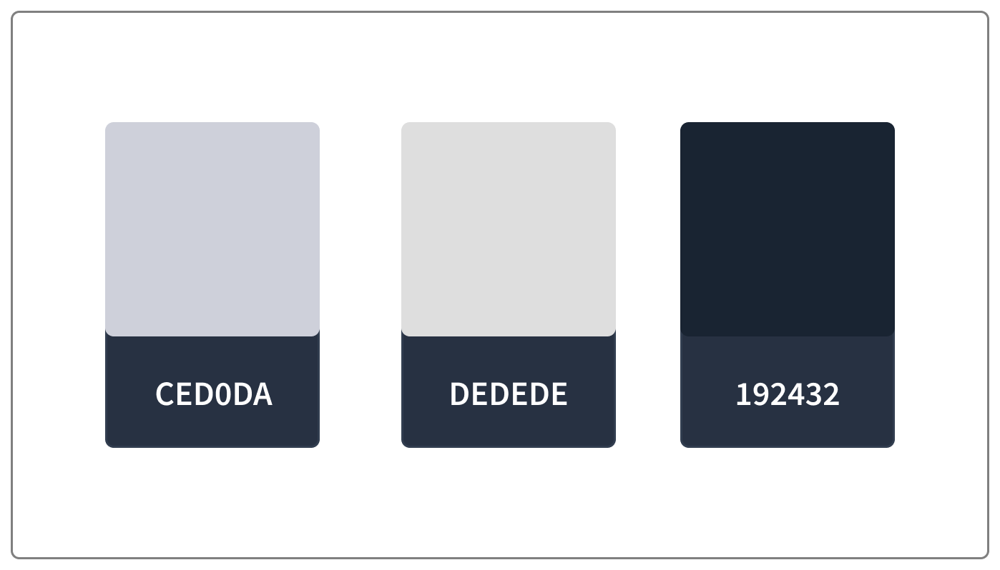

  

# Tokel brand assets

## Logo

Tokel logo represent universe. Tokel is a platform which will allow creation of tokens and nfts, which many projects will benefit from. Tokel is a space for all these projects to live and flourish in.

  

### Tokel Text Logo on Dark

#### SVG
[Tokel](https://github.com/TokelPlatform/tokel_app/raw/development/brand_package/assets/tokel-text.svg)

#### PNG
[Tokel](https://github.com/TokelPlatform/tokel_app/raw/development/brand_package/assets/tokel-text.png)

[Tokel x2](https://github.com/TokelPlatform/tokel_app/raw/development/brand_package/assets/tokel-textx2.png)

[Tokel x3](https://github.com/TokelPlatform/tokel_app/raw/development/brand_package/assets/tokel-textx3.png)

### Tokel Text Logo on White

#### SVG
[Tokel](https://github.com/TokelPlatform/tokel_app/raw/development/brand_package/assets/tokel-black-text.svg)

#### PNG
[Tokel](https://github.com/TokelPlatform/tokel_app/raw/development/brand_package/assets/tokel-black-text.png)

[Tokel x2](https://github.com/TokelPlatform/tokel_app/raw/development/brand_package/assets/tokel-black-textx2.png)

[Tokel x3](https://github.com/TokelPlatform/tokel_app/raw/development/brand_package/assets/tokel-black-textx3.png)

### Tokel Logo For Dark backgrounds

#### SVG
[Tokel](https://github.com/TokelPlatform/tokel_app/raw/development/brand_package/assets/tokel.svg)

#### PNG
[Tokel](https://github.com/TokelPlatform/tokel_app/raw/development/brand_package/assets/tokel.png)

[Tokel x2](https://github.com/TokelPlatform/tokel_app/raw/development/brand_package/assets/tokelx2.png)

[Tokel x3](https://github.com/TokelPlatform/tokel_app/raw/development/brand_package/assets/tokelx3.png)

### Tokel Logo For Light backgrounds

#### SVG
[Tokel](https://github.com/TokelPlatform/tokel_app/raw/development/brand_package/assets/tokelBlack.svg)

#### PNG
[Tokel](https://github.com/TokelPlatform/tokel_app/raw/development/brand_package/assets/tokelBlack.png)

[Tokel x2](https://github.com/TokelPlatform/tokel_app/raw/development/brand_package/assets/tokelBlackx2.png)

[Tokel x3](https://github.com/TokelPlatform/tokel_app/raw/development/brand_package/assets/tokelBlackx3.png)
